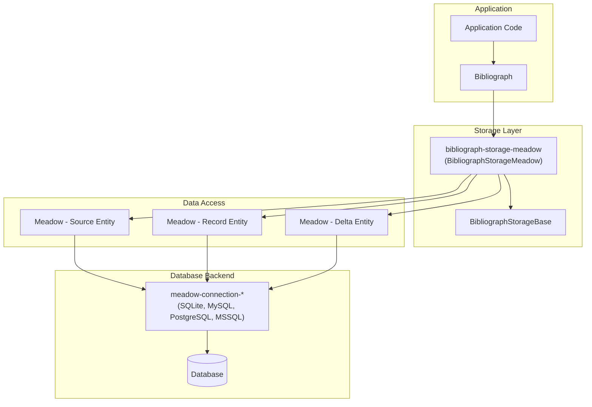
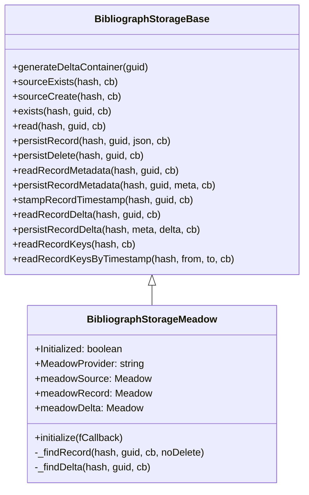
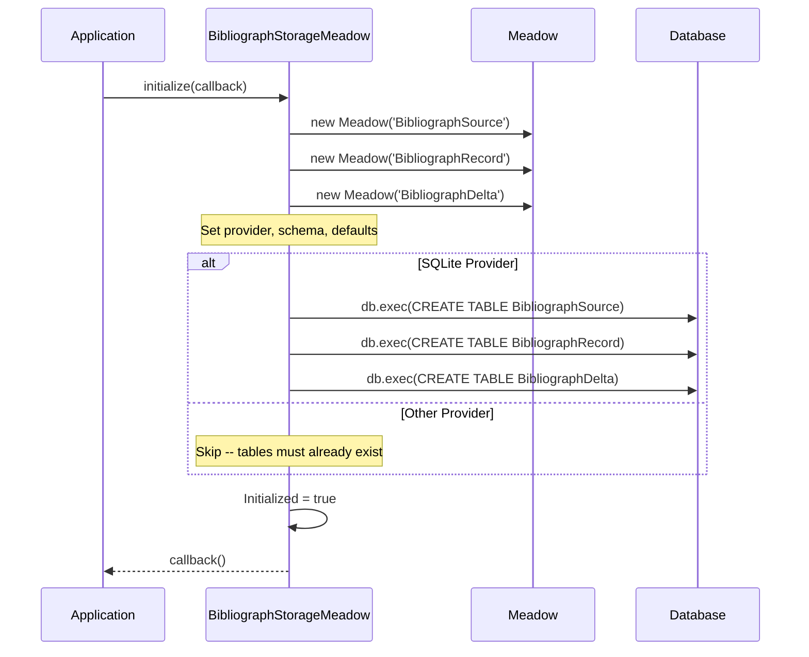
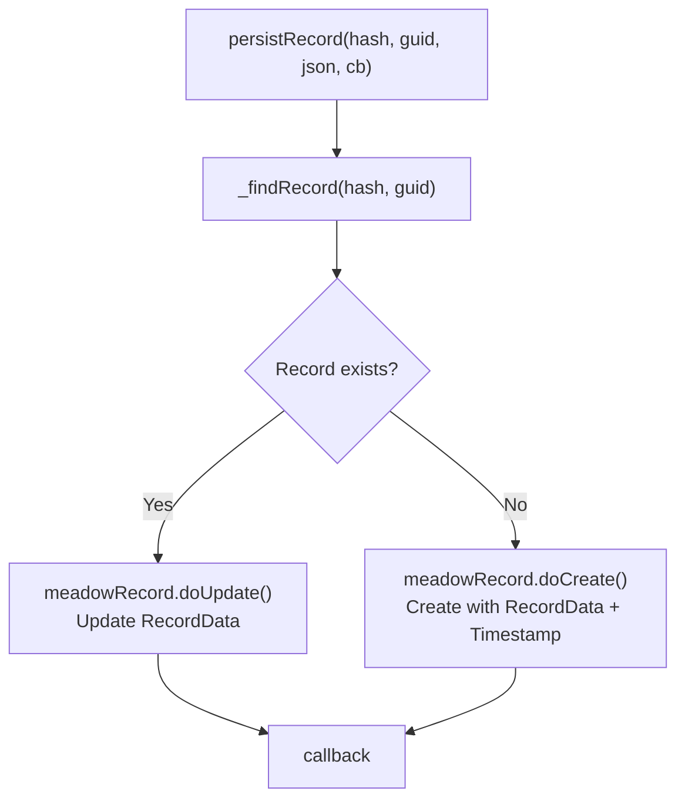
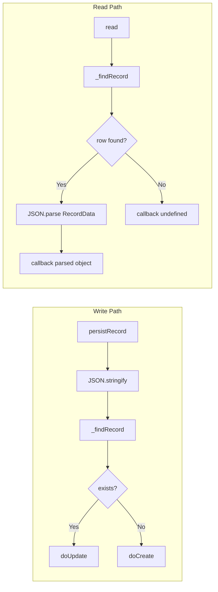
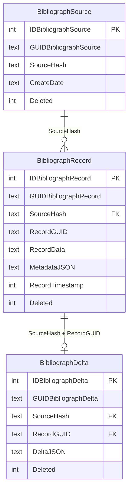

# Architecture

## System Overview

The `bibliograph-storage-meadow` module sits between the Bibliograph record management framework and the database, using Meadow as the data access layer. This allows Bibliograph to store records in any Meadow-supported database without knowing database-specific details.

## Class Hierarchy

## Initialization Flow

## Record Upsert Flow

All persist operations follow the same upsert pattern:

## Data Flow: Read vs Write

## Three-Table Model

## Key Design Decisions

| Decision | Rationale |
|----------|-----------|
| Upsert pattern | Simplifies the API -- callers do not need to check existence before writing |
| JSON serialization | Records and metadata are schema-less; the database stores serialized JSON |
| Soft delete | Meadow manages `Deleted`, `DeleteDate`, `DeletingIDUser` fields automatically |
| Epoch ms timestamps | `RecordTimestamp` stores numeric epoch milliseconds for fast range queries |
| SQLite auto-create | SQLite is the default dev/test backend; auto-DDL reduces setup friction |
| Three Meadow entities | Source, Record, and Delta are independent entities with distinct schemas |
| SourceHash isolation | All queries include `SourceHash` to prevent cross-source data leakage |
